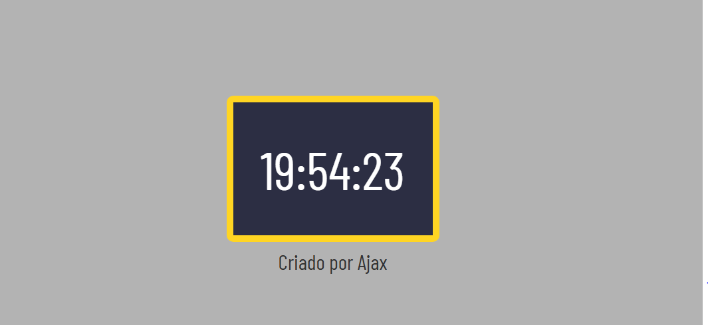

<h1 align="center"> Relógio </h1>

Marcador de horas em tempo real.

  <a href="#-tecnologias">Tecnologias</a>&nbsp;&nbsp;&nbsp;|&nbsp;&nbsp;&nbsp;
  <a href="#-projeto">Projeto</a>&nbsp;&nbsp;&nbsp;|&nbsp;&nbsp;&nbsp;

 

  

## 🚀 Tecnologias

Esse projeto foi desenvolvido com as seguintes tecnologias:

- HTML e CSS
- JavaScript
- Git e Github

## 💻 Projeto

Este projeto consiste na criação de um relógio que marca as horas em tempo real de acordo com o horário de brasília.

---

Feito por Guilherme Lins Oliveira.
